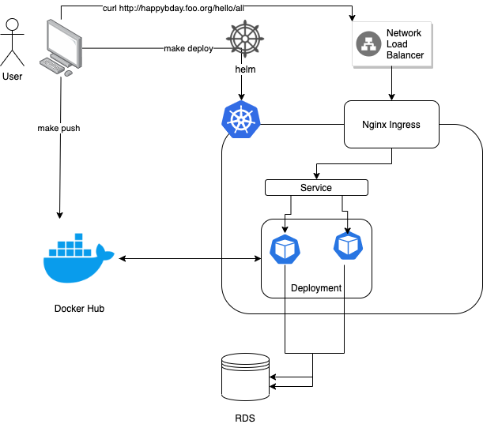

# Happy birthday application
An API Based application that stores and prints the User's birthday. This project runs a containerized Golang Application with the [Gin Web Framework](https://github.com/gin-gonic/gin).

## How it works
It receives PUT and GET HTTP requests at the `/hello/<username>` endpoint path. 

In order to create a new user, make a PUT request to the mentioned endpoint, with a non-existing username containing a json body with the date of birth e.g:
```json
curl http://localhost:8080/hello/gusampaio --include \
--header "Content-Type: application/json"  \
--request "PUT" \
--data '{"date_of_birth": "1997-02-18"}'
```

To check an existing user, make a GET request to the mentioned endpoint, with a existing username. It will print how many days until his birthday e.g:
```shell
$ curl http://localhost:8080/hello/gusampaio
{
    "message": "Hello gusampaio! Your Bithday is in 130 days"
}
```
You can run the application on your local computer by running `make run`. It will build and run the app with [docker compose](https://docs.docker.com/compose/), that will also spin up a postgres database.

### Validations
Before storing a new user into the database, the application validates:

- If the username already exists into the DB
- If the username only contain letters
- If the date of Birth is in the correct format `YYYY-MM-DD`
- If the day of birth is not greater than today

### Deployment
You can deploy it on k8s by running `make deploy`. This will:
- Test the application
- Build the docker image
- Push it to Docker Hub
- Deploy it on kubernetes with Helm, creating the following resources:
    - A `Deployment` to run the application
    - A `Service` to expose the application to the k8s cluster
    - An `Ingress` to define the redirection rules in order to receive the http requests

## Cloud diagram


## Cheat Sheet
```shell
# Run locally with docker compose
# This command spins up two docker containers
# a postgres db and the application
$ make run

# Test your applicaiton locally
$ make test 

# Test, Build and Push your image to the Docker Hub
$ make push

# Test, Build and Push  your docker image to Docker hub and Deploy your k8s resopurces into the cluster
$ make deploy

# Create new user
$ curl http://localhost:8080/hello/<username> --include \
  --header "Content-Type: application/json"  \
  --request "PUT" \ 
  --data '{"date_of_birth": "YYYY-MM-DD"}'`

# Check existing user and how long for its birthday
$ curl http://localhost:8080/hello/<username>
```

## Requirements
- Uppdate the variable `DOCKER_REPO` inside the `Makefile` to point to your own [Docker registry](https://docs.docker.com/docker-hub/)
- [Docker](https://docs.docker.com/get-docker/) installed in your local machine
- [kubectl](https://kubernetes.io/docs/tasks/tools/) installed in your local machine
  - kubectl should be already configured and pointing to the correct cluster
- [helm](https://helm.sh/docs/intro/install/) Installed on your local machine
- [go](https://golang.org/doc/install) Installed on your local machine

### In order to deploy this application on AWS is expected that you have:
- A running [EKS](https://docs.aws.amazon.com/eks/latest/userguide/create-cluster.html) cluster
- [Network Load Balancer with the NGINX Ingress Controller on Amazon EKS](https://aws.amazon.com/blogs/opensource/network-load-balancer-nginx-ingress-controller-eks/) configured
- [RDS Postgres](https://docs.aws.amazon.com/AmazonRDS/latest/UserGuide/CHAP_GettingStarted.CreatingConnecting.PostgreSQL.html) database already running with DB `hbday_db`
- Update the `env` in [backend-chart/values.yaml](backend-chart/values.yaml) in order to set correct db connection configuration, pointing to RDS
